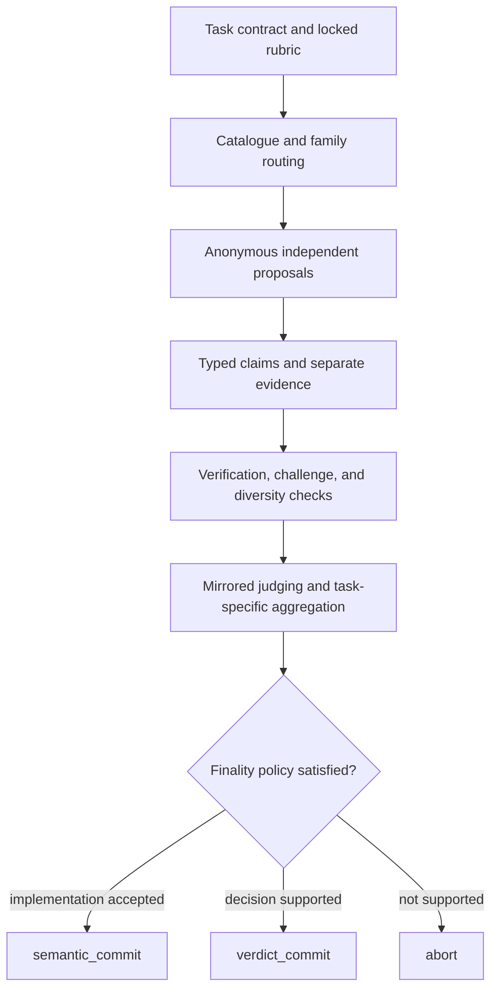
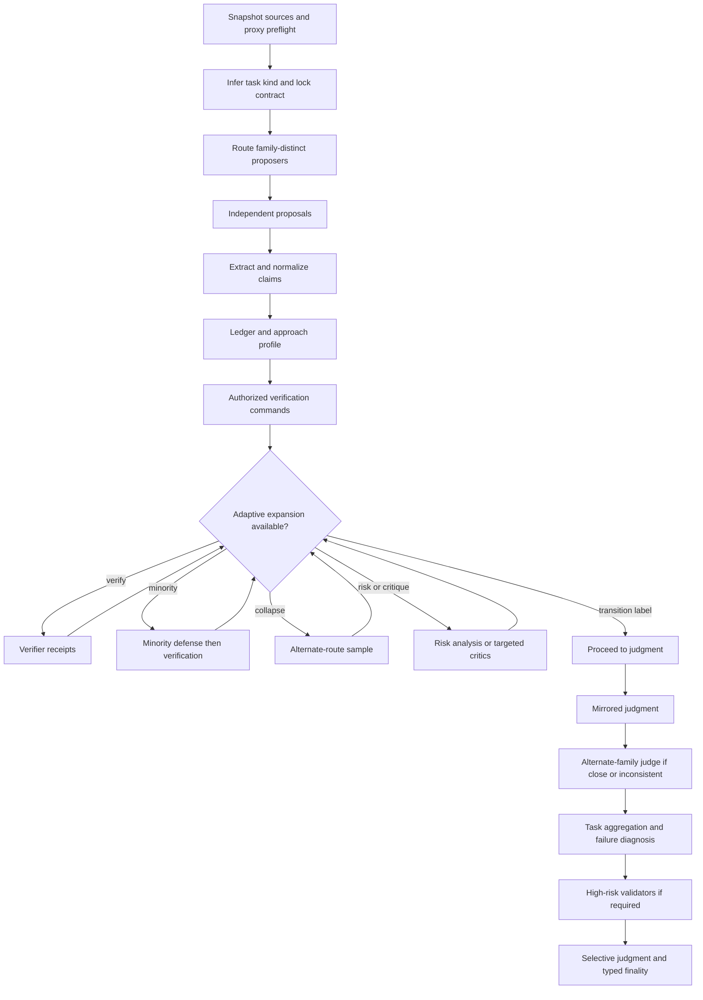
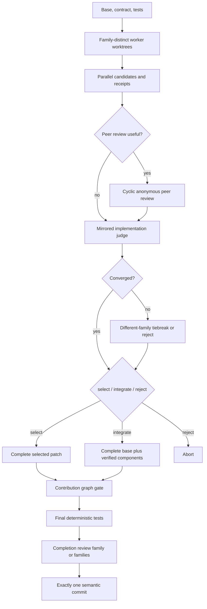

# Reason Assembly

`reason-assembly` is an evidence-backed multi-model orchestration tool for decisions,
adversarial analysis, code review, evidence synthesis, and competing implementation.
It runs through a local
[CLIProxyAPI](https://github.com/router-for-me/CLIProxyAPI)-compatible endpoint,
routes catalogued model IDs into explicit roles, and records the evidence and policy
that allowed or prevented a final result.

It is deliberately **model-ID-only**. Proxy aliases are launcher conveniences; run
artifacts identify the actual model IDs used.

> [!IMPORTANT]
> Reason Assembly is orchestration software, not a truth oracle, a safety
> certification, or a substitute for accountable human review. Requests leave your
> machine for the providers configured behind your proxy. Never place credentials,
> private keys, or unreviewed sensitive material in prompts, context, sources, run
> artifacts, issues, or bug reports.

## Why use structured multi-model work?

More model calls do not automatically produce more independent evidence. Models can
share training data, reasoning habits, tool failures, and persuasive mistakes. A
majority can therefore be confidently wrong.

Reason Assembly treats each run as a controlled evidence process:

1. lock the task contract, rubric, evidence requirements, and risk class;
2. select eligible, sufficiently distinct model families for named roles;
3. collect anonymous proposals before exposing cross-candidate evidence;
4. verify typed claims and preserve their source and dependency genealogy;
5. challenge load-bearing claims, dissent, and representational collapse;
6. judge with position-balanced ballots and calibrated acceptance rules; and
7. issue typed finality or abstain, retaining replayable private artifacts.



## Roles

Roles are protocol responsibilities, not permanent personalities or guarantees of
independence. A model may be suitable for one role and ineligible for another.

The canonical role identifiers and responsibilities are:

| Role identifier | Responsibility | Separation rule |
| --- | --- | --- |
| `proposer` | Produce a candidate answer, hypothesis, review finding, or plan against the locked rubric. | Works independently and initially sees neither author identities nor competing proposals. |
| `evidence_extractor` | Convert candidate assertions and supplied material into typed, source-linked claims. | Evidence is stored separately from proposal prose. |
| `critic` | Attack assumptions and candidate reasoning. | Targets claims and evidence rather than model identity. |
| `risk_analyst` | Identify task-specific hazards, blockers, and consequence paths. | Supplies risk evidence; it does not unilaterally certify safety. |
| `minority_advocate` | Develop and defend the strongest coherent minority case. | Protects load-bearing novelty from premature consensus. |
| `verifier` | Test falsifiable claims with deterministic checks, independent sources, or contradiction analysis. | Reports unresolved and conflicting evidence rather than forcing a pass/fail answer. |
| `judge` | Score candidates against the precommitted rubric using position-balanced ballots. | Does not receive candidate author identity; judging expands only when policy requires it. |
| `validator` | Independently validate a judgment or safety conclusion. | Is distinct from the judge whose conclusion it checks. |
| `worker` | Create one isolated implementation candidate from the common contract. | Uses a disposable Git worktree and cannot alter another candidate. |
| `test_constructor` | Construct or assess acceptance checks for implementation work. | Test quality is tracked separately and also contributes to worker reliability. |
| `integrator` | Construct the final candidate from accepted contributions and rerun acceptance checks. | Integration is independently checked before implementation finality. |
| `utility` | Reserved routing identity used for task-contract and claim-normalization support. | Adaptive operation choice itself is deterministic policy plus activated observational scores, not an autonomous planner. |

Aggregation is a deterministic protocol responsibility rather than a canonical routed
role. It applies the task-specific decision rule, reliability information, and dissent
policy but cannot convert missing evidence into consensus.

## Task-pattern matrix

The protocol changes with the epistemic shape of the task rather than applying one
vote to every problem.

| Task pattern | Primary mechanism | Aggregation | Required guardrails |
| --- | --- | --- | --- |
| **Objective / testable decision** | Competing hypotheses plus mechanical or independently reproducible checks. | Prefer the candidate best supported by verified load-bearing claims. | Conflicts are tested before more debate; failed checks taint dependent claims. |
| **Evidence synthesis** | Source-tagged claim extraction, provenance, contradiction mapping, and coverage checks. | Fuse compatible supported claims while preserving uncertainty and source disagreement. | Retrieved instructions are quarantined as data; unsupported synthesis cannot become evidence. |
| **Subjective / preference-sensitive decision** | Diverse proposals, explicit trade-offs, and pairwise comparison against a locked rubric. | Ranked pairs with dissent retained. | No claim of objective truth; stakeholder values must be supplied rather than invented. |
| **Safety or high-consequence review** | Threat-focused proposals, qualified-family review, substantiated vetoes, and independent verification. | A supported blocker defeats a popularity result. | At least two qualified families; abstain when load-bearing uncertainty remains. |
| **Code review** | The common council pipeline over an explicit Git diff, with `task_kind=review`. | Verifier-weighted common judgment; no separate review-specific ranking engine is currently wired. | Authorized mechanical receipts dominate rhetoric; scope is never silently broadened. |
| **Adversarial analysis** | Independent attack surfaces, rebuttal, and coherent-minority preservation. | Report supported failure modes and residual uncertainty, not a winner alone. | Novel minority claims receive defense and verification opportunities. |
| **Competing implementation** | Isolated workers, deterministic acceptance checks, peer review, judging, and integration. | Contribution-aware selection followed by a separately verified integrated candidate. | Clean worktrees, explicit base and test contract, no application without `semantic_commit`. |

## Composition cookbook: what works best, when

There is no benchmark in this repository proving one model lineup universally best.
“Most effective” below means the strongest composition supported by the current
protocol for a stated task, budget, and failure mode. Recommendations use four evidence
levels:

| Level | Meaning |
| --- | --- |
| **Enforced invariant** | Code and tests enforce the behavior: for example family separation, mirrored order, deterministic checks, contribution completeness, or validator gates. |
| **Adaptive empirical policy** | Activated reliability may change routing within model/family/role/task/domain buckets; activated operation effects may change the next operation within a task kind. This is observational, not causal proof. |
| **Recommended heuristic** | The order follows implemented failure-mode logic but has not won a comparative benchmark or ablation study. |
| **Unsupported claim** | The project does not claim that more models, raw majority, same-family duplication, or any named provider is inherently superior. |

### Fast decision guide

| Task | Recommended composition and order | Budget | Useful diversity | Escalate when | Strongest evidence / finality |
| --- | --- | --- | --- | --- | --- |
| Low-risk, testable question | 2 family-distinct proposers → claims → verify unresolved load-bearing claims → mirrored judge | `quick` | 2 proposer families; judge may be reserved | testable conflict, missing evidence, or order inconsistency | deterministic receipt; otherwise guarded `verdict_commit` or abstention |
| Complex objective decision | 3 family-distinct proposers → extraction/claims → verification, minority defense, or collapse recovery → mirrored judge → alternate-family judge if needed | `standard` | 3 families when available | unresolved conflict, novel minority, approach collapse, close ballots | receipts plus claim coverage and finality gates |
| Subjective trade-off | proposers using different value decompositions → preserve conflicts → common mirrored judgment with ranked-pairs aggregation semantics → retain dissent | `standard` | distinct families and genuinely distinct rubrics | hidden stakeholder assumption or unstable pairwise preference | transparent rubric and dissent; no objective-truth claim |
| Evidence synthesis | source extraction → independent synthesis proposals → claim ledger → critic/synthesis pass if conflict remains → contradiction-preserving judgment | `standard` or `max` | source and approach diversity, not model count alone | source contradiction, missing provenance, or unsupported fusion | source-linked claims and verification receipts |
| High-risk or safety gate | family-diverse proposers → verification/risk analysis → mirrored judge → 2 non-judge validator families → at most 1 revision/revalidation cycle | `max` | at least 2 qualified validator families in addition to the judge family | any load-bearing uncertainty, veto, missing route, or failed validator | deterministic/independent evidence; otherwise `abort` |
| Red-team | initial independent positions → attacks informed by them → defenses and updated positions informed by both sets → common judgment/finality | normally `standard` | family-diverse attack and defense perspectives | unresolved supported failure mode | fixed three-pass adversarial structure; ordinary adaptive rounds are disabled |
| Code review | explicit Git diff → common independent proposals/claims → authorized checks where available → verifier-weighted common judgment | `standard` | family-distinct reviewers | disputed finding or checkable claim | diff-scoped receipts; no bespoke severity-ranking stage |
| Competing implementation | family-distinct workers → candidate tests → conditional cyclic peer review → mirrored judge → optional cross-family tiebreak → select/integrate → graph gate → final tests → completion review(s) | `standard` or `max` | distinct worker families plus judge/reviewer family separation | overlapping patches, weak evidence, judge non-convergence, or incomplete graph | final engine-owned tests and independent completion review; `semantic_commit` only |

### The most effective ordering principles

These are more important than simply adding another model:

1. **Lock the contract before generation.** A rubric written after seeing answers can
   reward the preferred answer retroactively.
2. **Generate in parallel before cross-exposure.** Independent proposals preserve more
   useful disagreement than a sequential group chat where later models anchor on the
   first response.
3. **Separate prose from claims.** Extract source-linked, testable claims before asking a
   judge to compare persuasive narratives.
4. **Test conflicts before adding debate.** A deterministic check is usually cheaper and
   stronger than two more critics arguing about a measurable fact.
5. **Defend a coherent load-bearing minority before sampling more answers.** Extra
   majority-like proposals can amplify a shared error.
6. **Measure approach collapse before spending the reserve.** Different wording or model
   IDs do not imply different decomposition, tools, evidence, or commitments.
7. **Mirror candidate order before adding another judge.** The same judge seeing forward
   and reversed order exposes position bias at lower family cost; a different-family
   judge is reserved for non-convergence.
8. **Use risk analysis before final validation.** Risk analysis expands the threat model;
   validators then test the actual provisional verdict and blockers.
9. **Integrate only complete, verified contributions.** Candidate-level quality does not
   prove arbitrary patch fragments compose safely.
10. **Rerun checks after integration.** Tests on source candidates do not establish that
    the combined result works.

### Normal council order

The wired `decide` and `review` lifecycle is:



The total model-call ceilings are 12/30/60 for `quick`/`standard`/`max`.
Within those ceilings, ordinary adaptive expansion is capped at 1/2/3 operations.
`red-team` uses zero ordinary adaptive operations because it spends calls on its fixed
attack/defense sequence. `--max-calls` overrides the normal total call ceiling.

Task kind is inferred in this precedence: implementation; review; detected risk terms
become `safety_gate`; compare/recommend/trade-off prompts become
`subjective_tradeoff`; synthesize/research/evidence prompts become
`evidence_synthesis`; everything else becomes `objective_answer`. The inferred kind
changes aggregation and which adaptive branch is eligible.

### Which adaptive labels actually call another model?

The decision schema is broader than the set of separately executed stages:

| Policy decision | Trigger | Current runtime effect | Extra model work |
| --- | --- | --- | --- |
| `verify` | testable conflict or missing load-bearing evidence | build a verification plan and collect verifier receipts | yes |
| `minority_defense` | one coherent supporter for an unresolved load-bearing claim | defend the claim, then verify it when a step is available | yes |
| `sample` | approach-level representational collapse | add one alternate-family proposal under an exclusion contract | yes |
| `safety_validate` | safety task with blockers/conflicts | add a risk-analyst hypothesis, then proceed conservatively | yes |
| `targeted_rebuttal` | unresolved non-testable conflict/missing evidence | call up to two family-distinct critic routes | yes |
| `synthesize` | evidence-synthesis conflict | call critic routes with synthesis instructions | yes |
| `blocked_escalation` | too few calls remain while material blockers persist | stop expansion and preserve blockers | no |
| `stop`, `direct_judgment` | no useful expansion or learned utility is non-positive | proceed to common judgment | no |
| `higher_order_aggregate`, `pairwise_compare`, `ranked_pairs` | task/policy chooses an aggregation transition | stop adaptive expansion and proceed to common mirrored judgment/aggregation | no distinct stage today |

Operation choice is implemented policy in `choose_operation`: a fixed failure-mode
priority may be replaced after activation by the highest observed task-scoped operation
score. It is not an autonomous utility-model planner, and the observed score is not
proof that the operation generalizes to new distributions.

### Combination and order trade-offs

| Combination | Prefer it when | Why the order matters | Current support / cost |
| --- | --- | --- | --- |
| Parallel proposers, then critique | solution space is uncertain | preserves independent hypotheses before anchoring | normal flow; proposer calls scale with council size |
| Proposer → verifier | dispute is measurable | evidence can end the dispute without rhetorical expansion | first adaptive priority |
| Proposer → critic → verifier | assumptions or threat model are incomplete | critic exposes a precise claim for the verifier to test | conditional; usually costs both a critic and verifier call |
| Source extraction → proposals | retrieved evidence is central | all proposers receive the same structured source basis | normal flow when extraction succeeds |
| Proposals → claim normalization | candidate claims need stable IDs/comparison | normalization prevents wording differences from fragmenting the ledger | normal flow when the normalization route is available |
| Same judge mirrored twice | position bias is the main concern | reversing order isolates order sensitivity without changing evaluator | normal judging baseline |
| Different-family tiebreak judge | mirrored ballots do not converge | adds evaluator diversity only after cheaper bias detection | conditional and budget-dependent |
| Family-distinct ensemble | shared-family correlation is plausible | operational family separation is stronger than counting IDs | enforced selection heuristic; not proof of independence |
| Direct candidate selection | one implementation is complete and best-supported | avoids integration risk and preserves a tested whole patch | supported `select` action |
| Contribution integration | complementary verified work is needed | complete base first, then dependency-complete components | supported `integrate`; extra worker and final-test cost |
| Conditional peer review | patches overlap, criteria are complementary, or verification is weak | review effort is spent only where cross-candidate information can change the result | implemented policy |
| Minority defense → more sampling | one novel load-bearing claim exists | tests the existing dissent before flooding the ledger with more proposals | normal priority order |
| Risk analysis → validators | the provisional threat model may be incomplete | validators assess the expanded ledger and provisional verdict | high-risk path |

Manual `--route` overrides can reproduce some role combinations, but they cannot add a
stage that the engine does not implement. Overrides should use distinct families where
possible; repeatedly selecting one family reduces the value of a council even when the
model IDs differ.

### Budget recipes

**Quick — cheapest defensible composition** *(recommended heuristic)*

- two healthy proposer families when available;
- one adaptive opportunity, normally verification before critique;
- mirrored judgment;
- use for bounded, low-risk tasks with a clear acceptance test.

```sh
reason-assembly decide "Compare these two reversible options" \
  --budget quick \
  --verify-command "python verify_inputs.py"
```

**Standard — default consequential composition** *(recommended heuristic plus enforced
invariants)*

- three proposer families when available;
- up to two adaptive operations;
- verification, minority defense, or collapse recovery before extra debate;
- alternate-family judge only when mirrored ballots are close or inconsistent.

```sh
reason-assembly decide --prompt-file decision.md \
  --context evidence.md \
  --budget standard \
  --route proposer=MODEL_A:medium \
  --route proposer=MODEL_B:medium \
  --route proposer=MODEL_C:medium
```

**Max — unresolved, high-complexity, or safety composition**

- reserve alternate families for collapse recovery, validation, and tiebreaking;
- up to three adaptive operations;
- high-risk evidence and validator gates override convenience; missing validator routes
  force blocked/abstained finality, while missing proposer-family quorum fails the run
  rather than manufacturing a smaller pseudo-consensus.

```sh
reason-assembly decide --prompt-file launch-gate.md \
  --context risk-register.md \
  --verify-command "./run_acceptance_checks.sh" \
  --budget max
```

`adaptive` selects `max` when risk terms are detected, `standard` for red-team,
implementation, or large inputs, `quick` for short low-risk prompts, and otherwise
`standard`.

## Family-aware routing

Catalogue membership, role eligibility, live health, and family diversity are
separate concepts:

| State | Meaning | Effect |
| --- | --- | --- |
| **Catalogued** | The model ID appears in the proxy's raw `/v1/models` response. | It can be considered at all. |
| **Eligible** | Matching capability metadata permits the requested role. | It may be routed into that role; raw-only models remain `listed-only`. |
| **Healthy** | A bounded live probe reached a terminal health classification. | It informs diagnostics and operator judgment, not alias membership. |
| **Family-distinct** | The route contributes a sufficiently different provider/model family or approach channel for this task. | It can satisfy diversity requirements; multiple IDs from one correlated family do not automatically count as independent views. |

Routing ranks an eligible route with the implemented weighted score:

```text
45% role fit + 30% reliability + 20% independence + 5% health latency
```

These weights are policy constants, not fitted optima. Role fit also contains explicit
model-ID substring heuristics plus capability checks; it is an operational routing rule,
not benchmark proof that a named model is best for a role.

The current independence component is fixed at `0.5`. Although `peer_models` is passed
while filling multiple seats, the scorer does not use it, so learned pair independence
does **not** affect routing. Family exclusion still prevents duplicate families within
the selected seats. On a deterministic 20% of run IDs, the lowest-ranked eligible row
is moved into the exploration seat and marked exploratory.

Routing policy can reserve fixed models for judge/validator, utility, and integrator
work; those reserved models are excluded from the general candidate pool. Explicit
`--route ROLE=MODEL_ID:EFFORT` overrides take precedence for that role, but still
require the model to be catalogued, eligible for the role, support the requested
effort, and preserve one selected route per family.

Historical route reliability may influence selection only after its evidence gate is
met. Family labels and model IDs are operational proxies for correlation, not proof of
statistical independence.

Every catalogue read synchronizes raw IDs and capability metadata, retries one
transient mismatch, and keeps raw IDs authoritative if drift persists. Metadata-only
entries are excluded; raw-only entries remain visible but ineligible. Smart-alias
pruning is membership-based, not health-based, and produces a private,
credential-free receipt below the configured state root.

## Anonymous proposals and evidence separation

Candidate author identity is hidden during proposal comparison and judging. This
reduces brand, provider, and prestige bias; it does not make text style truly
unidentifiable.

Proposal text is not evidence. Assertions are extracted into typed claims with source
references, verification state, and dependency edges. Verifiers operate on those
claims and receipts. Judges receive the evidence packet appropriate to their role,
not an unstructured transcript that rewards repetition or eloquence. Claim genealogy
allows later falsification or source compromise to taint every dependent conclusion.

## Approach diversity

Reason Assembly measures diversity at the strategy level, not by counting different
wording. Each `ApproachSignature` records eight dimensions: `decomposition`,
`operations`, `constraints`, `assumptions`, `tools`, `evidence_classes`,
`intermediate_commitments`, and `answer_cluster`.

Those dimensions produce four named signed-hash views: `decomposition`,
`operations_tools`, `evidence_assumptions`, and `commitments`. The resulting
`ApproachProfile` reports `surface_distance`, `approach_distance`, per-view
`mean_distance` and `effective_rank`, `metric_disagreement`, estimated effective
channels, qualified families, an independence deficit, representational collapse,
novel minority approaches, and warnings. Collapse is currently flagged when more than
one signature exists and `approach_distance < 0.15`; a warning also identifies when
surface distance exceeds approach distance by more than `0.20`, meaning phrasing
variety may be masking strategy collapse.

Low effective rank means apparently separate candidates are behaving like copies. The
engine can then sample under an exclusion contract that asks for a genuinely different
approach, defend a load-bearing novel minority, or spend remaining calls on direct
comparison. These measurements are heuristics over declared and extracted features;
they do not establish causal independence or guarantee novel reasoning.

## Adaptive deliberation

Budgets are ceilings, not targets. The policy evaluates the current claim ledger,
approach profile, risk, evidence completeness, route reliability, verifier availability,
and calls reserved for mandatory judging. During cold start it prefers: verify a
testable conflict; defend load-bearing novelty; recover from approach collapse; apply
task-specific safety/synthesis logic; then rebut unresolved non-testable ambiguity.

After 20 labeled outcomes, an operation-effect bucket may become active and replace the
cold-start order with the highest value under its implemented observational score.
That score is task-scoped and cost-adjusted; it is not a learned general planner and is
not evidence that the selected operation is globally optimal. Call limits, family
requirements, verification rules, and finality always remain authoritative.

See the cookbook tables above for the exact operation caps and the distinction between
operations that execute a new model call and labels that transition directly to common
judgment. Generic debate, unbounded group chat, and raw-majority correctness are not
protocol stages or claims.

## Judging and aggregation

Judging starts with mirrored ballots: candidate order and left/right position are
reversed to expose positional preference. It expands only as needed, up to six
evaluations. Close or inconsistent ballots trigger comparison, verification, or
abstention rather than an automatic majority.

Aggregation is task-specific:

- objective tasks privilege deterministic and independent receipts;
- subjective tasks use ranked pairs and preserve dissent;
- safety tasks honor substantiated vetoes and qualified-family requirements;
- evidence synthesis combines source-tagged compatible claims;
- review reports supported findings without suppressing coherent minority findings;
- implementation requires acceptance evidence and a clean contribution graph.

When external checks are unavailable, the engine may consider guarded route
reliability, empirical joint failure, evidence coherence, predicted peer agreement,
and coherent minority support. None is a substitute for missing decisive evidence.

## Competing implementation

Implementation uses a separate composition optimized for patch provenance and
post-composition verification:

1. Lock one base commit, task, acceptance contract, verification mode, and test command.
2. Route family-distinct workers and distribute acceptance-criterion focus round-robin.
3. Give each route a disposable worktree; the same route acts as worker and
   `test_constructor` for its candidate.
4. Produce candidates in parallel and retain only candidates with valid engine-owned
   receipts.
5. Enable cyclic anonymous peer review only when candidates have complementary focus,
   overlapping changed files, or weak verification. For three candidates the topology
   is A→B, B→C, C→A.
6. Ask the reserved implementation judge for forward and reversed ballots. If action
   and selected candidate still disagree, use one different-family tiebreak judge when
   the call reserve permits; otherwise reject.
7. Apply one of three actions:
   - `select`: keep the selected candidate as a complete patch and include all of its
     contributions;
   - `integrate`: apply one complete base candidate, then ask the integrator to add only
     selected, verified, dependency-complete components from other candidates;
   - `reject`: preserve evidence and stop without a final branch.
8. Block selection/integration when contribution conflicts, missing dependencies, or
   uncovered acceptance criteria remain.
9. Rerun final tests and `git diff --check` on the selected or integrated result. A
   non-documentation implementation cannot reach semantic finality without an explicit
   deterministic test command.
10. Require one independent completion review for ordinary work or two family-distinct
    completion reviews for high-risk work, excluding the judge family.
11. Create exactly one commit on the declared base and only then issue
    `semantic_commit`.



Use direct selection when one complete candidate already covers the contract; it is
cheaper and avoids composition risk. Use integration only for complementary verified
contributions whose dependencies and conflicts are explicit. Documentation-only
changes may use docs verification mode; tested code requires an explicit test command.

```sh
reason-assembly implement \
  --repo /path/to/repo \
  --base main \
  --task-file task.md \
  --test-command "pytest -q" \
  --worker-timeout 900

# Documentation-only implementation composition
reason-assembly implement \
  --repo /path/to/repo \
  --base main \
  --task-file docs-task.md \
  --verification-mode docs
```

`apply` accepts only a completed implementation run carrying `semantic_commit`. It
applies the accepted patch to the requested repository but does not commit or push.
Always inspect the resulting diff and rerun the repository's acceptance checks.

## Calibration and correlated failure

Reason Assembly learns only from explicit observed outcomes. Reliability buckets are
keyed by **model × family × role × task kind × domain** and decay with a 90-day
half-life. An exact bucket activates at `n=8` effective observations. Before that, a
matching family × role × task-kind × domain fallback activates only at `n=20`
effective observations; otherwise the returned reliability is the cold value `0.5`.

An active exact score weights six components: 50% conservative correctness lower
bound, 15% error detection, 10% order consistency, 10% revision success, 10%
calibration, and 5% robustness against competitor failures. It does not treat
self-confidence or judge agreement as ground truth.

- **Route reliability** estimates realized performance for one complete reliability
  key and feeds the 30% routing component after activation.
- **Co-failure** records whether routes fail together; it is inactive below 30 ordinary
  or 60 high-risk observations. Learned pair independence is not incorporated into the
  current route score.
- **Operation utility** estimates which next deliberation step resolves uncertainty;
  it is inactive below 20 labeled outcomes.
- **Selective judgment** permits calibrated acceptance only when its exact error bound
  and sample threshold are satisfied: at least 29 accepted examples for the 10% rule
  or 59 for the 5% rule.
- **Cold start** caps ordinary confidence at 0.65. High-risk and implementation runs
  abstain unless deterministic or independent evidence resolves load-bearing criteria.
- **Anchors and route epochs** detect catalogue or policy drift so stale calibration is
  not silently applied to a changed routing population.

Historical accuracy can improve routing and acceptance discipline, but observational
calibration does not prove independence, eliminate distribution shift, or guarantee
future correctness.

Calibration can change composition only through guarded paths:

- activated reliability changes the 30% reliability component of route ranking;
- deterministic 20% exploration may seat a lower-ranked eligible route and collect
  evidence about alternatives;
- activated operation effects may change the next adaptive operation after 20 labeled
  outcomes;
- council-set co-failure affects confidence only after 30 ordinary or 60 high-risk
  observations;
- selective judgment needs at least 29 or 59 accepted examples for its 10% or 5%
  regimes; and
- route epochs and anchors limit reuse of routing/calibration records after catalogue or
  policy drift; operation effects are currently filtered only by task kind.

Current implementation boundaries are explicit: learned pair independence does not
change route selection; `peer_models` is unused by the scorer; proposer–verifier
`joint_failure` is not passed into the normal finality path; the `higher_order_select`
helper is not called by normal orchestration; and provisional selective-judgment support
derived from validated anchors exists as a helper but is not wired into the normal run
flow. These mechanisms must not be inferred from persisted schemas or helper functions
alone.

## Composition anti-patterns

| Avoid | Why |
| --- | --- |
| Raw majority voting | Correlated models can repeat one persuasive error; evidence and blockers outrank popularity. |
| Counting several IDs from one family as independent | Family labels are imperfect proxies, but same-family duplication is weaker than deliberate family separation. |
| Showing later proposers the first answer | Sequential anchoring reduces the value of independent generation. |
| Using the proposer as the only verifier and judge | Role separation reduces self-confirmation; high-risk validators must be non-judge families. |
| Adding critics before running an available deterministic check | More language does not beat a reproducible receipt for a testable conflict. |
| Treating different wording as different strategy | Use approach decomposition, tools, evidence, assumptions, and commitments to detect collapse. |
| Eagerly peer-reviewing every patch | The implementation policy reserves peer review for complementary, overlapping, or weakly verified candidates. |
| Integrating arbitrary patch fragments | Contributions must be verified, dependency-complete, conflict-free, and cover the contract. |
| Trusting candidate tests after integration | The combined result must rerun engine-owned final checks. |
| Forcing a verdict when family quorum, validators, or evidence are missing | The correct result is abstention or `abort`, not a smaller pseudo-consensus. |
| Treating unit tests as proof of model accuracy gains | Tests establish protocol mechanics and invariants; this repository has no comparative model-composition benchmark. |

## Finality, taint, and run lifecycle

Verification states are `supported`, `partially_supported`, `conflicting`,
`falsified`, `inconclusive`, and `not_checked`. Finality is typed:

| Finality | Meaning |
| --- | --- |
| `semantic_commit` | An implementation candidate and its acceptance evidence satisfy implementation finality; it may be passed to `apply`. |
| `verdict_commit` | A decision or report satisfies its verdict policy, but authorizes no code application. |
| `abort` | Evidence, calibration, integrity, or policy requirements were not met. |

Source, claim, and evidence dependencies form a genealogy. If a source is invalidated,
a verifier fails, an artifact changes, or an outcome correction contradicts an earlier
claim, taint propagates transitively into dependent judgments and finality. A run is
never upgraded merely because it completed all planned calls.

Runs preserve task contracts, routing, proposals, claims, receipts, ballots, dissent,
finality, integrity data, and observed outcomes. Replay continues the evidence process
without rewriting history. Revisit records a correction. Regrade is a deterministic,
call-free reporting child under new grading rules. Outcome recording feeds guarded
calibration. Schemas 1–3 are rejected rather than guessed into schema v4.

## Install

Requirements:

- Python 3.11 or newer (CI covers 3.11–3.13);
- [`uv`](https://docs.astral.sh/uv/);
- a POSIX shell;
- a running CLIProxyAPI-compatible endpoint and configuration; and
- Git for `review` and `implement`.

```sh
git clone https://github.com/jroth1111/reason-assembly.git
cd reason-assembly
uv sync --locked --dev
./bin/reason-assembly --version
```

The default proxy configuration path on macOS is:

```text
~/Library/Application Support/AIUsage/CLIProxyAPI/config.yaml
```

Canonical runtime configuration uses:

- `REASON_ASSEMBLY_STATE` for the private state root (default
  `~/.local/state/reason-assembly/`);
- `REASON_ASSEMBLY_PROXY_CONFIG` for the proxy configuration path;
- `REASON_ASSEMBLY_WORKER` for the implementation worker executable;
- `REASON_ASSEMBLY_EPHEMERAL_KEY` for the ephemeral worker key;
- `REASON_ASSEMBLY_ROUTING_POLICY` for the routing policy; and
- `REASON_ASSEMBLY_<ROLE>_MODEL` for a fixed per-role model.

`CCYPROXY_CONFIG` remains supported because it belongs to the separate proxy adapter.
A custom canonical state root is isolated. Startup does not import or discover other
state layouts, and state-oriented commands operate only on the configured canonical
root.

## Start with a catalogue audit

```sh
reason-assembly sync
reason-assembly sync --json
reason-assembly models
reason-assembly doctor --all-models
reason-assembly doctor --all-models --live --json
```

`sync --json` reports raw, metadata, and eligible counts, ID-set equality, alias
resolution, removals, warnings, and outcome without printing proxy credentials.
`doctor --all-models --json` gives every current model one terminal classification.

## Run workflows

```sh
# Decision
reason-assembly decide "Choose a migration strategy" --budget adaptive

# Evidence and explicit verification
reason-assembly decide \
  --prompt-file task.md \
  --context architecture.md \
  --source https://example.invalid/design \
  --verify-command "pytest -q" \
  --budget standard

# Adversarial analysis
reason-assembly red-team "Find the strongest failure modes" --budget quick

# Code review: choose exactly one explicit Git scope
reason-assembly review --repo /path/to/repo --working-tree
reason-assembly review --repo /path/to/repo --staged
reason-assembly review --repo /path/to/repo --base main
reason-assembly review --repo /path/to/repo --range main..feature
reason-assembly review --repo /path/to/repo --commit abc1234

# Competing implementation
reason-assembly implement \
  --repo /path/to/repo \
  --base main \
  --task-file task.md \
  --test-command "pytest -q" \
  --worker-timeout 900

# Apply an accepted implementation without committing or pushing
reason-assembly apply RUN_ID --repo /path/to/repo
```

Use only HTTPS sources. A verification or test command is code you explicitly
authorize the tool to execute; inspect it with the same care as any shell command.
Explicit route overrides use `--route ROLE=MODEL_ID:EFFORT`.

## Inspect, replay, and calibrate

```sh
reason-assembly show RUN_ID
reason-assembly show RUN_ID --artifact verdict.json --json
reason-assembly replay RUN_ID
reason-assembly revisit RUN_ID --correction "What changed and why"
reason-assembly outcome RUN_ID confirmed --notes "Observed in production"
reason-assembly regrade RUN_ID --rules grading-rules.json
reason-assembly stats --json

reason-assembly anchors import anchors.json
reason-assembly anchors list --active
reason-assembly anchors validate
reason-assembly anchors retire ANCHOR_ID
```

Private filesystem permissions reduce accidental local disclosure; they do not make
provider-bound inputs private.

## Explicit limitations and non-claims

Reason Assembly does **not** claim that:

- multiple models are independent, unbiased, or collectively correct;
- family labels, approach signatures, or effective-rank estimates recover true latent
  reasoning diversity;
- anonymous presentation fully removes identity or style cues;
- model-generated citations, verifier judgments, consensus, or confidence are evidence
  without an appropriate receipt;
- calibration learned on past tasks remains valid after route, provider, policy, or
  distribution drift;
- a `verdict_commit` certifies safety, legality, factual truth, or fitness for use;
- a `semantic_commit` proves a patch has no defects outside the stated acceptance
  contract;
- automated red-teaming replaces domain experts, stakeholder consent, or accountable
  approval;
- local private storage prevents disclosure to configured providers; or
- the system performs local weight ensembling, parameter merging, dense mixtures,
  latent-state fusion, or training of a learned router.

The protocol can make uncertainty, evidence, disagreement, and decision policy more
auditable. It cannot manufacture ground truth that the task and available evidence do
not contain.

## Skill and protocol references

- [`SKILL.md`](SKILL.md) is the explicit-invocation operating contract.
- [`agents/openai.yaml`](agents/openai.yaml) is the agent manifest.
- [`references/protocol.md`](references/protocol.md) is the concise schema-v4 protocol.
- [`references/research.md`](references/research.md) summarizes transferred mechanisms.
- [`references/provenance.md`](references/provenance.md) records design boundaries.

The skill is never triggered implicitly. Python wheels carry the skill payload below
`share/reason-assembly/`.

## Security and development

Generated runs, local state, proxy configuration, authentication material, private
keys, certificates, and local agent scratch data must not be committed. Before a
public release, inspect Git history as well as the working tree for identities,
credentials, private paths and URLs, prompts, sources, and run evidence. See
[`PUBLIC_RELEASE_CHECKLIST.md`](PUBLIC_RELEASE_CHECKLIST.md).

```sh
uv sync --locked --dev
uv run ruff check .
uv run pytest -q
uv run python -m compileall -q src scripts tests
```

Contributions are welcome; see [`CONTRIBUTING.md`](CONTRIBUTING.md). Security reports
should follow [`SECURITY.md`](SECURITY.md).

## License

MIT. See [`LICENSE`](LICENSE).
