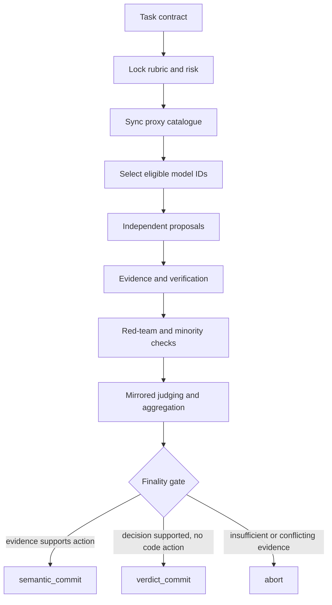
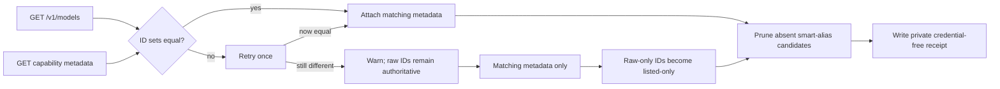
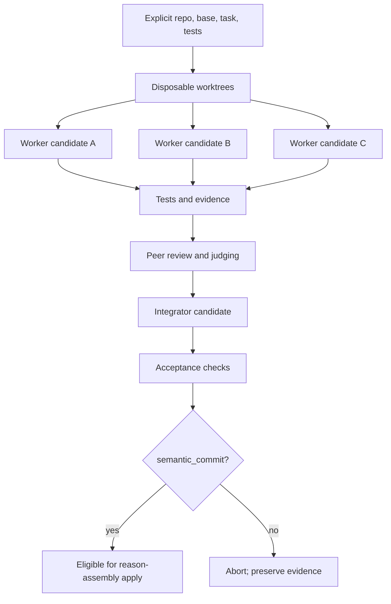

# Reason Assembly

`reason-assembly` is an evidence-backed, multi-model council for consequential
decisions, adversarial review, code review, and competing implementation
workflows. It runs explicitly against a local
[CLIProxyAPI](https://github.com/router-for-me/CLIProxyAPI)-compatible proxy,
discovers the models that proxy currently advertises, assigns models to roles,
and records why a result was or was not allowed to become final.

The council is deliberately **model-ID-only**. Friendly proxy aliases such as
`worker` remain a launcher concern; the council stores and reports the actual
catalogued model IDs it used.

> [!IMPORTANT]
> This is orchestration software, not a truth oracle. Council traffic leaves
> your machine for whichever providers your proxy is configured to use. Never
> put credentials, secrets, private keys, or unreviewed sensitive data into a
> prompt, context file, source URL, run artifact, issue, or bug report.

## What problem it solves

A majority vote among several language models can still be confidently wrong.
`reason-assembly` instead treats a decision as an evidence process:

- lock the task contract and rubric before seeing candidate answers;
- use independent model roles and typed claims rather than one long group chat;
- distinguish model availability from model suitability and live health;
- request deterministic or independently verified evidence for important claims;
- surface dissent, blockers, uncertainty, and co-failure risk;
- permit a final result only when its finality policy is satisfied; and
- preserve private, replayable artifacts for later review and calibration.



## Availability has three different meanings

These terms are intentionally not interchangeable:

| State | Meaning | What it controls |
| --- | --- | --- |
| **Catalogued** | The model ID is present in the proxy's raw `/v1/models` response. | Alias membership and whether the model can be selected at all. |
| **Eligible** | Matching capability metadata permits the model to perform a requested council role. | Council routing. A raw-only model is retained as `listed-only`, not silently treated as eligible. |
| **Healthy** | A bounded live `doctor` probe reached one terminal health classification. | Diagnostics and operator judgment. Temporary unhealthiness does not remove an advertised alias candidate. |

## Continuous catalogue synchronization

Every council catalogue read performs synchronization, and a proxy launcher can
invoke the same audit before resolving aliases:



Pruning is membership-based, not health-based. The synchronizer:

- exclusively locks the proxy configuration;
- removes only smart-alias candidates absent from the raw catalogue;
- preserves unrelated YAML text, comments, ownership, and private permissions;
- uses an atomic replacement and never creates credential-bearing backups;
- warns and continues if metadata, pruning, or receipt persistence fails; and
- writes schema-v4, credential-free receipts below the configured Reason Assembly
  state root (by default `~/.local/state/reason-assembly/v4/`).

When metadata remains out of step after one retry, `/v1/models` is authoritative.
Metadata-only entries are excluded. Raw-only entries remain visible as
`listed-only`, which prevents an absent or unqualified model from being selected
while preserving an honest view of the proxy catalogue.

## Requirements

- Python 3.11 or newer (CI covers 3.11–3.13)
- [`uv`](https://docs.astral.sh/uv/)
- a POSIX shell (`zsh` is preferred; `/bin/sh` is the fallback)
- a running CLIProxyAPI-compatible endpoint
- a proxy configuration containing `host`, `port`, and any required
  authentication plus optional `smart-aliases`
- Git for `review` and `implement` workflows

The default proxy configuration path on macOS is:

```text
~/Library/Application Support/AIUsage/CLIProxyAPI/config.yaml
```

Override it on any platform:

```sh
export CCYPROXY_CONFIG=/path/to/config.yaml
```

## Install

Clone the repository and install its locked dependencies:

```sh
git clone https://github.com/jroth1111/reason-assembly.git
cd reason-assembly
uv sync --locked --dev
./bin/reason-assembly --version
```

To make the command available from any directory, add the repository's `bin`
directory to `PATH`, install the package with `uv tool install .`, or symlink
`bin/reason-assembly` into a directory already on `PATH`.

### Compatibility with ccycouncil 0.4.x

`ccycouncil` remains as a deprecated forwarding command for explicit compatibility;
new integrations should invoke `reason-assembly` directly. The deprecated command
and `model-council` skill alias remain supported throughout 0.5.x; any removal will
be announced in a future changelog. On first normal CLI use,
Reason Assembly non-destructively copies missing legacy state from
`~/.local/state/ccycouncil` into `~/.local/state/reason-assembly`. Only terminal,
stable runs are published into the canonical tree. Incomplete or subsequently
changed legacy runs remain available through read-only discovery instead of being
merged or shadowed. Existing non-imported canonical runs win whole-run ID collisions.

Canonical environment variables are `REASON_ASSEMBLY_STATE`,
`REASON_ASSEMBLY_PROXY_CONFIG`, and `REASON_ASSEMBLY_EPHEMERAL_KEY`. The legacy
`CCYCOUNCIL_STATE` and `CCYCOUNCIL_EPHEMERAL_KEY` names remain accepted during the
compatibility window; `CCYPROXY_CONFIG` remains accepted as the proxy adapter's own
configuration variable. A custom `REASON_ASSEMBLY_STATE` is isolated from the
default legacy tree unless `CCYCOUNCIL_STATE` is also set explicitly for a controlled
compatibility import.

## Start with the proxy audit

```sh
reason-assembly sync
reason-assembly sync --json
reason-assembly models
reason-assembly doctor --all-models
reason-assembly doctor --all-models --live --json
```

`sync --json` reports raw, metadata, and council counts and equality; alias
resolution; removed candidates; warnings; and the final outcome. It does not
print proxy credentials. `doctor --all-models --json` adds synchronization and
alias diagnostics and gives every current model one terminal classification.

The public helper in [`examples/ccyproxy-sync.zsh`](examples/ccyproxy-sync.zsh)
shows how a shell launcher can refresh immediately before route resolution.
Launchers should still intersect every resolved candidate with the current raw
catalogue before selecting it.

## Decision and red-team workflows

Provide a prompt directly or from a file:

```sh
reason-assembly decide "Choose a migration strategy for this service"

reason-assembly decide \
  --prompt-file task.md \
  --context architecture.md \
  --source https://example.invalid/design \
  --verify-command "pytest -q" \
  --budget standard \
  --json

reason-assembly red-team \
  "Find the strongest failure modes in this launch plan" \
  --budget quick
```

Budgets are `adaptive`, `quick`, `standard`, and `max`. Their normal call caps
are 12, 30, and 60 for the named fixed budgets; `--max-calls` is authoritative
when supplied. Add explicit route overrides with:

```sh
reason-assembly decide "..." --route proposer=model-id:high
```

Use `--source` only for HTTPS sources. `--verify-command` runs a command you
explicitly authorize; review it with the same care as any other shell command.

## Code review

`review` operates on an explicit Git target:

```sh
reason-assembly review --repo /path/to/repo --working-tree
reason-assembly review --repo /path/to/repo --staged
reason-assembly review --repo /path/to/repo --base main
reason-assembly review --repo /path/to/repo --range main..feature
reason-assembly review --repo /path/to/repo --commit abc1234
```

The council packages the selected diff, asks independent reviewers to produce
typed findings, challenges disputed findings, and aggregates evidence and
minority opinions. It does not silently broaden the selected Git scope.

## Competing implementation

`implement` creates disposable Git worktrees, gives multiple workers the same
task contract, verifies their results, and has independent roles compare the
candidates before an integrator produces the final patch.



Example:

```sh
reason-assembly implement \
  --repo /path/to/repo \
  --base main \
  --task-file task.md \
  --test-command "pytest -q" \
  --worker-timeout 900
```

`apply` accepts only an implementation run with `semantic_commit`. It applies
the accepted patch to the requested repository but does not commit or push:

```sh
reason-assembly apply RUN_ID --repo /path/to/repo
```

Always inspect the resulting diff and rerun the repository's acceptance checks.

## Runs, replay, outcomes, and calibration

Run artifacts are private by default under
`~/.local/state/reason-assembly/runs/`. Useful commands include:

```sh
reason-assembly show RUN_ID
reason-assembly show RUN_ID --artifact verdict.json --json
reason-assembly replay RUN_ID
reason-assembly revisit RUN_ID --correction "What changed and why"
reason-assembly outcome RUN_ID confirmed --notes "Observed in production"
reason-assembly regrade RUN_ID --rules grading-rules.json
reason-assembly stats --json

reason-assembly anchors import anchors.json
reason-assembly anchors list --active
reason-assembly anchors validate
reason-assembly anchors retire ANCHOR_ID
```

Artifacts include task contracts, routing, typed claims, verification receipts,
judging data, dissent, finality, and outcome observations. Private filesystem
permissions reduce accidental local disclosure; they do not make provider-bound
model inputs private.

## Agent skill usage

The repository is also a distributable Codex-style skill:

- [`SKILL.md`](SKILL.md) is the canonical operating contract.
- [`agents/openai.yaml`](agents/openai.yaml) contains the agent-facing manifest.
- [`references/protocol.md`](references/protocol.md) defines the protocol.
- [`references/research.md`](references/research.md) and
  [`references/provenance.md`](references/provenance.md) document the design
  basis and source provenance.

Install the cloned repository as the canonical skill directory, then link its
self-contained compatibility alias if an older integration still invokes it:

```sh
ln -s /path/to/reason-assembly "$HOME/.agents/skills/reason-assembly"
ln -s reason-assembly/compat/model-council "$HOME/.agents/skills/model-council"
```

Python wheels also carry these skill payloads below `share/reason-assembly/`.
The skill requires explicit invocation: ask to run `reason-assembly` or invoke the
installed `reason-assembly` skill. `$model-council` remains an explicit deprecated
alias during 0.5.x. Neither skill may be triggered implicitly.

## What must never be committed

The `.gitignore` excludes common local and generated material, including:

- `.venv`, bytecode, caches, coverage, build output, logs, and editor state;
- `.env*`, proxy `config.yaml`, local YAML overrides, authentication folders,
  credentials, private keys, and certificates;
- council run artifacts, state, sync receipts, and generated evidence; and
- local agent scratch directories.

Before publishing a fork, also inspect the full Git history—not only the current
working tree—for names, email addresses, usernames, home-directory paths, host
names, account IDs, model-provider keys, bearer tokens, proxy credentials,
private URLs, prompts, source documents, and run evidence. See
[`PUBLIC_RELEASE_CHECKLIST.md`](PUBLIC_RELEASE_CHECKLIST.md).

## Development

```sh
uv sync --locked --dev
uv run ruff check .
uv run pytest -q
uv run python -m compileall -q scripts tests
```

Contributions are welcome; see [`CONTRIBUTING.md`](CONTRIBUTING.md). Security
reports should follow [`SECURITY.md`](SECURITY.md).

## License

MIT. See [`LICENSE`](LICENSE).
