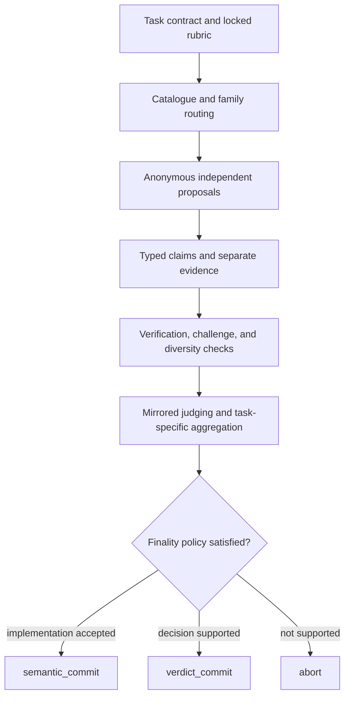
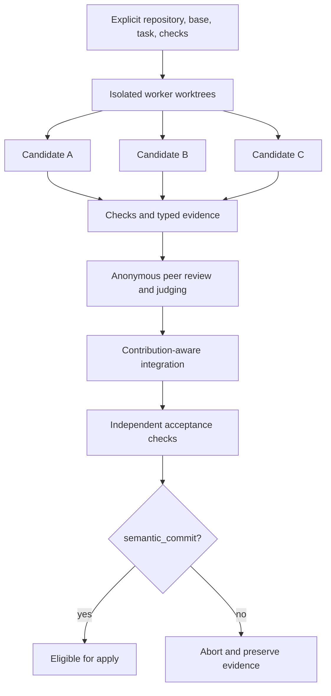

# Reason Assembly

`reason-assembly` is an evidence-backed multi-model orchestration tool for decisions,
adversarial analysis, code review, evidence synthesis, and competing implementation.
It runs through a local
[CLIProxyAPI](https://github.com/router-for-me/CLIProxyAPI)-compatible endpoint,
routes catalogued model IDs into explicit roles, and records the evidence and policy
that allowed or prevented a final result.

It is deliberately **model-ID-only**. Proxy aliases are launcher conveniences; run
artifacts identify the actual model IDs used.

> [!IMPORTANT]
> Reason Assembly is orchestration software, not a truth oracle, a safety
> certification, or a substitute for accountable human review. Requests leave your
> machine for the providers configured behind your proxy. Never place credentials,
> private keys, or unreviewed sensitive material in prompts, context, sources, run
> artifacts, issues, or bug reports.

## Why use structured multi-model work?

More model calls do not automatically produce more independent evidence. Models can
share training data, reasoning habits, tool failures, and persuasive mistakes. A
majority can therefore be confidently wrong.

Reason Assembly treats each run as a controlled evidence process:

1. lock the task contract, rubric, evidence requirements, and risk class;
2. select eligible, sufficiently distinct model families for named roles;
3. collect anonymous proposals before exposing cross-candidate evidence;
4. verify typed claims and preserve their source and dependency genealogy;
5. challenge load-bearing claims, dissent, and representational collapse;
6. judge with position-balanced ballots and calibrated acceptance rules; and
7. issue typed finality or abstain, retaining replayable private artifacts.



## Roles

Roles are protocol responsibilities, not permanent personalities or guarantees of
independence. A model may be suitable for one role and ineligible for another.

The canonical role identifiers and responsibilities are:

| Role identifier | Responsibility | Separation rule |
| --- | --- | --- |
| `proposer` | Produce a candidate answer, hypothesis, review finding, or plan against the locked rubric. | Works independently and initially sees neither author identities nor competing proposals. |
| `evidence_extractor` | Convert candidate assertions and supplied material into typed, source-linked claims. | Evidence is stored separately from proposal prose. |
| `critic` | Attack assumptions and candidate reasoning. | Targets claims and evidence rather than model identity. |
| `risk_analyst` | Identify task-specific hazards, blockers, and consequence paths. | Supplies risk evidence; it does not unilaterally certify safety. |
| `minority_advocate` | Develop and defend the strongest coherent minority case. | Protects load-bearing novelty from premature consensus. |
| `verifier` | Test falsifiable claims with deterministic checks, independent sources, or contradiction analysis. | Reports unresolved and conflicting evidence rather than forcing a pass/fail answer. |
| `judge` | Score candidates against the precommitted rubric using position-balanced ballots. | Does not receive candidate author identity; judging expands only when policy requires it. |
| `validator` | Independently validate a judgment or safety conclusion. | Is distinct from the judge whose conclusion it checks. |
| `worker` | Create one isolated implementation candidate from the common contract. | Uses a disposable Git worktree and cannot alter another candidate. |
| `test_constructor` | Construct or assess acceptance checks for implementation work. | Test quality is tracked separately and also contributes to worker reliability. |
| `integrator` | Construct the final candidate from accepted contributions and rerun acceptance checks. | Integration is independently checked before implementation finality. |
| `utility` | Estimate which bounded deliberation operation is most useful next. | May prioritize an operation only after activation; it cannot override safety, evidence, budget, or finality rules. |

Aggregation is a deterministic protocol responsibility rather than a canonical routed
role. It applies the task-specific decision rule, reliability information, and dissent
policy but cannot convert missing evidence into consensus.

## Task-pattern matrix

The protocol changes with the epistemic shape of the task rather than applying one
vote to every problem.

| Task pattern | Primary mechanism | Aggregation | Required guardrails |
| --- | --- | --- | --- |
| **Objective / testable decision** | Competing hypotheses plus mechanical or independently reproducible checks. | Prefer the candidate best supported by verified load-bearing claims. | Conflicts are tested before more debate; failed checks taint dependent claims. |
| **Evidence synthesis** | Source-tagged claim extraction, provenance, contradiction mapping, and coverage checks. | Fuse compatible supported claims while preserving uncertainty and source disagreement. | Retrieved instructions are quarantined as data; unsupported synthesis cannot become evidence. |
| **Subjective / preference-sensitive decision** | Diverse proposals, explicit trade-offs, and pairwise comparison against a locked rubric. | Ranked pairs with dissent retained. | No claim of objective truth; stakeholder values must be supplied rather than invented. |
| **Safety or high-consequence review** | Threat-focused proposals, qualified-family review, substantiated vetoes, and independent verification. | A supported blocker defeats a popularity result. | At least two qualified families; abstain when load-bearing uncertainty remains. |
| **Code review** | Independent typed findings over an explicit Git scope, followed by verification and challenge. | Rank supported findings by severity and confidence; retain disputed findings. | Mechanical receipts dominate rhetoric; scope is never silently broadened. |
| **Adversarial analysis** | Independent attack surfaces, rebuttal, and coherent-minority preservation. | Report supported failure modes and residual uncertainty, not a winner alone. | Novel minority claims receive defense and verification opportunities. |
| **Competing implementation** | Isolated workers, deterministic acceptance checks, peer review, judging, and integration. | Contribution-aware selection followed by a separately verified integrated candidate. | Clean worktrees, explicit base and test contract, no application without `semantic_commit`. |

## Family-aware routing

Catalogue membership, role eligibility, live health, and family diversity are
separate concepts:

| State | Meaning | Effect |
| --- | --- | --- |
| **Catalogued** | The model ID appears in the proxy's raw `/v1/models` response. | It can be considered at all. |
| **Eligible** | Matching capability metadata permits the requested role. | It may be routed into that role; raw-only models remain `listed-only`. |
| **Healthy** | A bounded live probe reached a terminal health classification. | It informs diagnostics and operator judgment, not alias membership. |
| **Family-distinct** | The route contributes a sufficiently different provider/model family or approach channel for this task. | It can satisfy diversity requirements; multiple IDs from one correlated family do not automatically count as independent views. |

Routing ranks an eligible route with the implemented weighted score:

```text
45% role fit + 30% reliability + 20% independence + 5% health latency
```

The current independence component is fixed at `0.5`. Although `peer_models` is passed
while filling multiple seats, the scorer does not use it, so learned pair independence
does **not** affect routing. Family exclusion still prevents duplicate families within
the selected seats. On a deterministic 20% of run IDs, the lowest-ranked eligible row
is moved into the exploration seat and marked exploratory.

Routing policy can reserve fixed models for judge/validator, utility, and integrator
work; those reserved models are excluded from the general candidate pool. Explicit
`--route ROLE=MODEL_ID:EFFORT` overrides take precedence for that role, but still
require the model to be catalogued, eligible for the role, support the requested
effort, and preserve one selected route per family.

Historical route reliability may influence selection only after its evidence gate is
met. Family labels and model IDs are operational proxies for correlation, not proof of
statistical independence.

Every catalogue read synchronizes raw IDs and capability metadata, retries one
transient mismatch, and keeps raw IDs authoritative if drift persists. Metadata-only
entries are excluded; raw-only entries remain visible but ineligible. Smart-alias
pruning is membership-based, not health-based, and produces a private,
credential-free receipt below the configured state root.

## Anonymous proposals and evidence separation

Candidate author identity is hidden during proposal comparison and judging. This
reduces brand, provider, and prestige bias; it does not make text style truly
unidentifiable.

Proposal text is not evidence. Assertions are extracted into typed claims with source
references, verification state, and dependency edges. Verifiers operate on those
claims and receipts. Judges receive the evidence packet appropriate to their role,
not an unstructured transcript that rewards repetition or eloquence. Claim genealogy
allows later falsification or source compromise to taint every dependent conclusion.

## Approach diversity

Reason Assembly measures diversity at the strategy level, not by counting different
wording. Each `ApproachSignature` records eight dimensions: `decomposition`,
`operations`, `constraints`, `assumptions`, `tools`, `evidence_classes`,
`intermediate_commitments`, and `answer_cluster`.

Those dimensions produce four named signed-hash views: `decomposition`,
`operations_tools`, `evidence_assumptions`, and `commitments`. The resulting
`ApproachProfile` reports `surface_distance`, `approach_distance`, per-view
`mean_distance` and `effective_rank`, `metric_disagreement`, estimated effective
channels, qualified families, an independence deficit, representational collapse,
novel minority approaches, and warnings. Collapse is currently flagged when more than
one signature exists and `approach_distance < 0.15`; a warning also identifies when
surface distance exceeds approach distance by more than `0.20`, meaning phrasing
variety may be masking strategy collapse.

Low effective rank means apparently separate candidates are behaving like copies. The
engine can then sample under an exclusion contract that asks for a genuinely different
approach, defend a load-bearing novel minority, or spend remaining calls on direct
comparison. These measurements are heuristics over declared and extracted features;
they do not establish causal independence or guarantee novel reasoning.

## Adaptive deliberation

Budgets are ceilings, not targets. `adaptive` chooses the next operation according to
the unresolved evidence state. During cold start, priority is:

1. verify a testable conflict;
2. defend load-bearing novelty;
3. recover from approach collapse with an exclusion contract;
4. actively compare close candidates; and
5. request targeted rebuttal for non-testable ambiguity.

The deliberation decision schema enumerates `stop`, `direct_judgment`,
`higher_order_aggregate`, `pairwise_compare`, `verify`, `sample`,
`targeted_rebuttal`, `minority_defense`, `ranked_pairs`, `synthesize`,
`safety_validate`, and `blocked_escalation`. Corresponding aggregation patterns are
verifier-weighted selection, higher-order aggregation, ranked pairs, criterion
integration, conservative veto, claim fusion, and mirrored pairwise comparison.

After enough labeled task-operation outcomes, guarded posterior estimates of
resolution utility may replace the cold-start order. The learned policy remains
subordinate to call limits, family requirements, verification rules, and finality.
Generic debate, unbounded group chat, and raw-majority correctness are not protocol
stages or claims.

Fixed budgets `quick`, `standard`, and `max` normally cap model calls at 12, 30, and
60. An explicit `--max-calls` remains authoritative.

## Judging and aggregation

Judging starts with mirrored ballots: candidate order and left/right position are
reversed to expose positional preference. It expands only as needed, up to six
evaluations. Close or inconsistent ballots trigger comparison, verification, or
abstention rather than an automatic majority.

Aggregation is task-specific:

- objective tasks privilege deterministic and independent receipts;
- subjective tasks use ranked pairs and preserve dissent;
- safety tasks honor substantiated vetoes and qualified-family requirements;
- evidence synthesis combines source-tagged compatible claims;
- review reports supported findings without suppressing coherent minority findings;
- implementation requires acceptance evidence and a clean contribution graph.

When external checks are unavailable, the engine may consider guarded route
reliability, empirical joint failure, evidence coherence, predicted peer agreement,
and coherent minority support. None is a substitute for missing decisive evidence.

## Competing implementation

`implement` creates disposable Git worktrees from one explicit base and gives each
worker the same task and acceptance contract. Candidate patches are tested, reviewed,
and judged independently. The integrator may select or combine accepted contributions,
but the integrated result is a new candidate and must pass acceptance checks itself.



`apply` accepts only a completed implementation run carrying `semantic_commit`. It
applies the accepted patch to the requested repository but does not commit or push.
Always inspect the resulting diff and rerun the repository's acceptance checks.

## Calibration and correlated failure

Reason Assembly learns only from explicit observed outcomes. Reliability buckets are
keyed by **model × family × role × task kind × domain** and decay with a 90-day
half-life. An exact bucket activates at `n=8` effective observations. Before that, a
matching family × role × task-kind × domain fallback activates only at `n=20`
effective observations; otherwise the returned reliability is the cold value `0.5`.

An active exact score weights six components: 50% conservative correctness lower
bound, 15% error detection, 10% order consistency, 10% revision success, 10%
calibration, and 5% robustness against competitor failures. It does not treat
self-confidence or judge agreement as ground truth.

- **Route reliability** estimates realized performance for one complete reliability
  key and feeds the 30% routing component after activation.
- **Co-failure** records whether routes fail together; it is inactive below 30 ordinary
  or 60 high-risk observations. Learned pair independence is not incorporated into the
  current route score.
- **Operation utility** estimates which next deliberation step resolves uncertainty;
  it is inactive below 20 labeled outcomes.
- **Selective judgment** permits calibrated acceptance only when its exact error bound
  and sample threshold are satisfied: at least 29 accepted examples for the 10% rule
  or 59 for the 5% rule.
- **Cold start** caps ordinary confidence at 0.65. High-risk and implementation runs
  abstain unless deterministic or independent evidence resolves load-bearing criteria.
- **Anchors and route epochs** detect catalogue or policy drift so stale calibration is
  not silently applied to a changed routing population.

Historical accuracy can improve routing and acceptance discipline, but observational
calibration does not prove independence, eliminate distribution shift, or guarantee
future correctness.

Current implementation boundaries are explicit: learned pair independence does not
change route selection; proposer–verifier `joint_failure` is not passed into the normal
finality path; the `higher_order_select` helper is not called by normal orchestration;
and provisional selective-judgment support derived from validated anchors exists as a
helper but is not wired into the normal run flow. These mechanisms must not be inferred
from persisted schemas or helper functions alone.

## Finality, taint, and run lifecycle

Verification states are `supported`, `partially_supported`, `conflicting`,
`falsified`, `inconclusive`, and `not_checked`. Finality is typed:

| Finality | Meaning |
| --- | --- |
| `semantic_commit` | An implementation candidate and its acceptance evidence satisfy implementation finality; it may be passed to `apply`. |
| `verdict_commit` | A decision or report satisfies its verdict policy, but authorizes no code application. |
| `abort` | Evidence, calibration, integrity, or policy requirements were not met. |

Source, claim, and evidence dependencies form a genealogy. If a source is invalidated,
a verifier fails, an artifact changes, or an outcome correction contradicts an earlier
claim, taint propagates transitively into dependent judgments and finality. A run is
never upgraded merely because it completed all planned calls.

Runs preserve task contracts, routing, proposals, claims, receipts, ballots, dissent,
finality, integrity data, and observed outcomes. Replay continues the evidence process
without rewriting history. Revisit records a correction. Regrade is a deterministic,
call-free reporting child under new grading rules. Outcome recording feeds guarded
calibration. Schemas 1–3 are rejected rather than guessed into schema v4.

## Install

Requirements:

- Python 3.11 or newer (CI covers 3.11–3.13);
- [`uv`](https://docs.astral.sh/uv/);
- a POSIX shell;
- a running CLIProxyAPI-compatible endpoint and configuration; and
- Git for `review` and `implement`.

```sh
git clone https://github.com/jroth1111/reason-assembly.git
cd reason-assembly
uv sync --locked --dev
./bin/reason-assembly --version
```

The default proxy configuration path on macOS is:

```text
~/Library/Application Support/AIUsage/CLIProxyAPI/config.yaml
```

Canonical runtime configuration uses:

- `REASON_ASSEMBLY_STATE` for the private state root (default
  `~/.local/state/reason-assembly/`);
- `REASON_ASSEMBLY_PROXY_CONFIG` for the proxy configuration path;
- `REASON_ASSEMBLY_WORKER` for the implementation worker executable;
- `REASON_ASSEMBLY_EPHEMERAL_KEY` for the ephemeral worker key;
- `REASON_ASSEMBLY_ROUTING_POLICY` for the routing policy; and
- `REASON_ASSEMBLY_<ROLE>_MODEL` for a fixed per-role model.

`CCYPROXY_CONFIG` remains supported because it belongs to the separate proxy adapter.
A custom canonical state root is isolated. Startup does not import or discover other
state layouts, and state-oriented commands operate only on the configured canonical
root.

## Start with a catalogue audit

```sh
reason-assembly sync
reason-assembly sync --json
reason-assembly models
reason-assembly doctor --all-models
reason-assembly doctor --all-models --live --json
```

`sync --json` reports raw, metadata, and eligible counts, ID-set equality, alias
resolution, removals, warnings, and outcome without printing proxy credentials.
`doctor --all-models --json` gives every current model one terminal classification.

## Run workflows

```sh
# Decision
reason-assembly decide "Choose a migration strategy" --budget adaptive

# Evidence and explicit verification
reason-assembly decide \
  --prompt-file task.md \
  --context architecture.md \
  --source https://example.invalid/design \
  --verify-command "pytest -q" \
  --budget standard

# Adversarial analysis
reason-assembly red-team "Find the strongest failure modes" --budget quick

# Code review: choose exactly one explicit Git scope
reason-assembly review --repo /path/to/repo --working-tree
reason-assembly review --repo /path/to/repo --staged
reason-assembly review --repo /path/to/repo --base main
reason-assembly review --repo /path/to/repo --range main..feature
reason-assembly review --repo /path/to/repo --commit abc1234

# Competing implementation
reason-assembly implement \
  --repo /path/to/repo \
  --base main \
  --task-file task.md \
  --test-command "pytest -q" \
  --worker-timeout 900

# Apply an accepted implementation without committing or pushing
reason-assembly apply RUN_ID --repo /path/to/repo
```

Use only HTTPS sources. A verification or test command is code you explicitly
authorize the tool to execute; inspect it with the same care as any shell command.
Explicit route overrides use `--route ROLE=MODEL_ID:EFFORT`.

## Inspect, replay, and calibrate

```sh
reason-assembly show RUN_ID
reason-assembly show RUN_ID --artifact verdict.json --json
reason-assembly replay RUN_ID
reason-assembly revisit RUN_ID --correction "What changed and why"
reason-assembly outcome RUN_ID confirmed --notes "Observed in production"
reason-assembly regrade RUN_ID --rules grading-rules.json
reason-assembly stats --json

reason-assembly anchors import anchors.json
reason-assembly anchors list --active
reason-assembly anchors validate
reason-assembly anchors retire ANCHOR_ID
```

Private filesystem permissions reduce accidental local disclosure; they do not make
provider-bound inputs private.

## Explicit limitations and non-claims

Reason Assembly does **not** claim that:

- multiple models are independent, unbiased, or collectively correct;
- family labels, approach signatures, or effective-rank estimates recover true latent
  reasoning diversity;
- anonymous presentation fully removes identity or style cues;
- model-generated citations, verifier judgments, consensus, or confidence are evidence
  without an appropriate receipt;
- calibration learned on past tasks remains valid after route, provider, policy, or
  distribution drift;
- a `verdict_commit` certifies safety, legality, factual truth, or fitness for use;
- a `semantic_commit` proves a patch has no defects outside the stated acceptance
  contract;
- automated red-teaming replaces domain experts, stakeholder consent, or accountable
  approval;
- local private storage prevents disclosure to configured providers; or
- the system performs local weight ensembling, parameter merging, dense mixtures,
  latent-state fusion, or training of a learned router.

The protocol can make uncertainty, evidence, disagreement, and decision policy more
auditable. It cannot manufacture ground truth that the task and available evidence do
not contain.

## Skill and protocol references

- [`SKILL.md`](SKILL.md) is the explicit-invocation operating contract.
- [`agents/openai.yaml`](agents/openai.yaml) is the agent manifest.
- [`references/protocol.md`](references/protocol.md) is the concise schema-v4 protocol.
- [`references/research.md`](references/research.md) summarizes transferred mechanisms.
- [`references/provenance.md`](references/provenance.md) records design boundaries.

The skill is never triggered implicitly. Python wheels carry the skill payload below
`share/reason-assembly/`.

## Security and development

Generated runs, local state, proxy configuration, authentication material, private
keys, certificates, and local agent scratch data must not be committed. Before a
public release, inspect Git history as well as the working tree for identities,
credentials, private paths and URLs, prompts, sources, and run evidence. See
[`PUBLIC_RELEASE_CHECKLIST.md`](PUBLIC_RELEASE_CHECKLIST.md).

```sh
uv sync --locked --dev
uv run ruff check .
uv run pytest -q
uv run python -m compileall -q src scripts tests
```

Contributions are welcome; see [`CONTRIBUTING.md`](CONTRIBUTING.md). Security reports
should follow [`SECURITY.md`](SECURITY.md).

## License

MIT. See [`LICENSE`](LICENSE).
